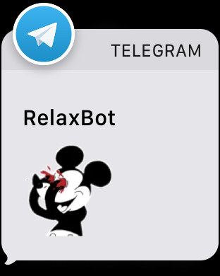
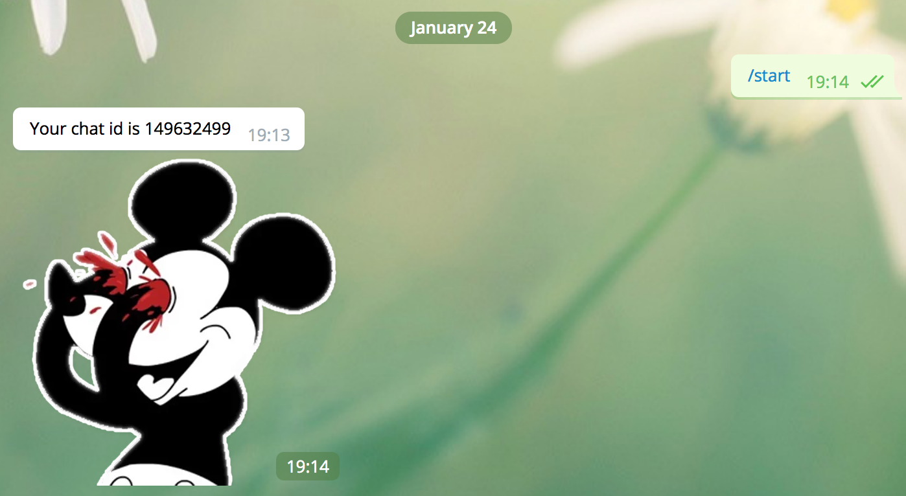

<h1>
  <center>
    
  </center>
</h1>

# Relax your eyes on work time

>
These codes is perfect way to relieve my eyes when I am at the computer.
I'm using telegram for messaging app. It has built in notify on desktop and mobile also apple watch. That's the reason I used telegram bot for notify me when per 15 min.


# Create telegram bot in 30 sec.
### https://core.telegram.org/bots#6-botfather

# Learn your chat id
>
Run your code with
```
node index.js
```
Then,
Start conversation with your own bot, then get your chat id.
<center>

</center>

# Code's usage

```
cd;
git clone git@github.com:cagataycali/RelaxEyes.git .relax
cd .relax
npm i;
vi config.json // For your config.
```

# Run with pm2
```
cd ~/.relax;
pm2 start index.js;
```
# For startup and daemonize
```
cd ~/.relax;
pm2 startup;
pm2 save;
```
